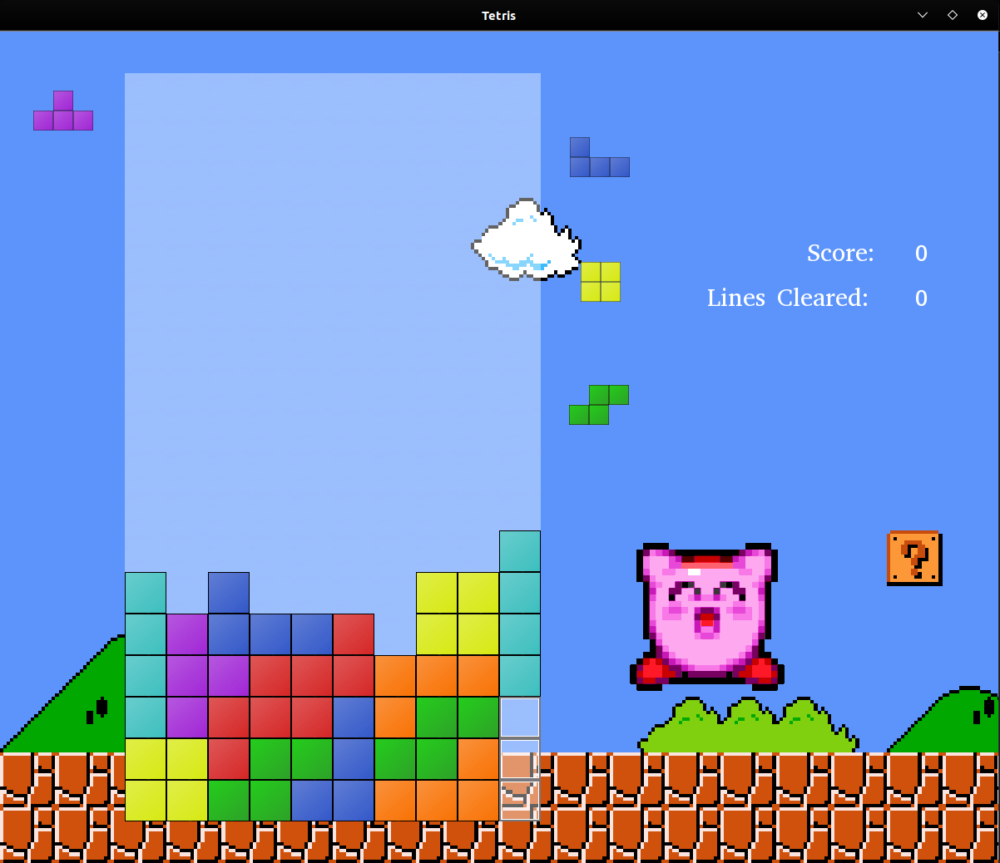

# reimagined-enigma
Simple open-source Tetris Game made using C++ and the SFML Library.

## Current Progress:
* Piece movement and rotation.
* Line clearing and clear animation.
* Super Rotation System! (kinda...)
* Score and total line clears displayed.
* Next Piece queue and hold piece!
* Ability for users to easily add new pieces... (like pentaminos!)

## TO-DO:
1. Levels with varying speed.
2. Title screen with game modes.
3. High score keeping.
4. Music and SFX! :D

## BUGS:
1. In some situations, rotating while moving can cause blocks to rotate where they should not be able to.
2. Ghost Piece does not account for spins.

## Needs Improved:
1. Representation of solid tiles in field.
