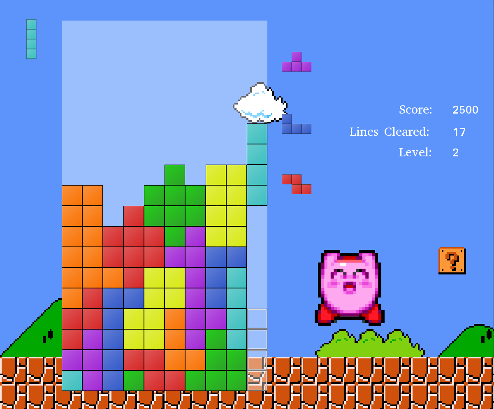

# reimagined-enigma
Simple open-source Tetris Game made using C++ and the SFML Library.

__Current Version: v1.0.3b__
Changes:
1. Changed piece movement and rotation to a polling system.
2. Fixed bug where piece could move through left wall.
3. Fixed bug where rotation offset down and up where swapped.

## Current Progress:
* Piece movement and rotation.
* Line clearing and clear animation.
* Super Rotation System! (kinda...)
* Score and total line clears displayed.
* Next Piece queue and hold piece!
* Ability for users to easily add new pieces... (like pentaminos!)
* State system for menus, modes, etc.
* Levels with varying speeds.

## TO-DO:
1. More game modes.
2. High score keeping.
3. Music and SFX! :D

## BUGS:
1. Ghost Piece does not account for spins.

## Needs Improved:
1. Representation of solid tiles in field.
